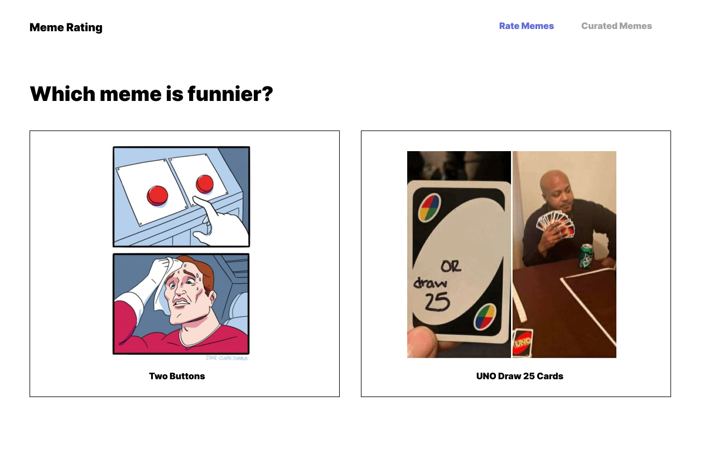
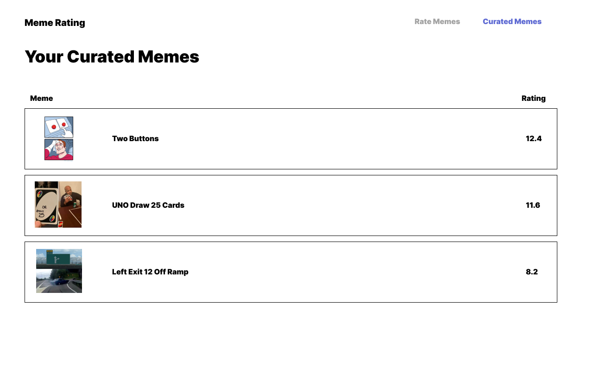

# Mob Programming Session - Meme Rating

## Goal

Create a small SPA that lets you rate your favorite memes based on the imageflip.com api.

## Acceptance Criteria

1. Retrieve the top 100 meme templates from imgflip.com.
2. Rate Memes - Create a view where the user can choose which one of two memes is funnier
3. Curated Memes - Create a view that lists all rated memes sorted by their rating

## Info

Meme API: [https://api.imgflip.com](https://api.imgflip.com)

Endpoint: get_memes

## UX Layouts

### Rate Memes

### Curated Memes

